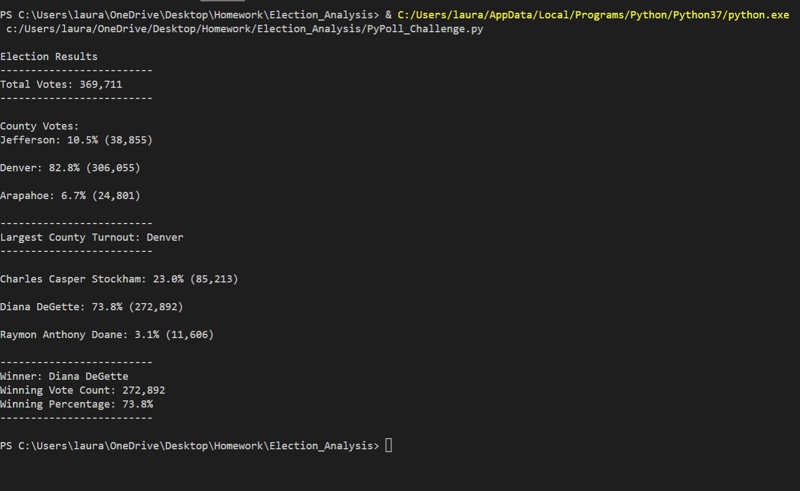

# PyPoll Election Analysis - Challenge Number 3 

## Overview of Election Audit
    The overview of the election audit is to assist the Colorado Board of Elections with streamlining the analysis of votes cast through various avenues such as mail-in ballots, punch cards and direct recording electronic or in-person votes from a specific congressional district.  By analyzing the data through Python code, the Board of Elections would be able to review the results in a much more systemized process rather than reviewing individual Excel spreadsheets.  If this particular use of Python and review of the data went well, it could be used for other various elections.  We were able to provide accurate results of total votes, total votes cast for a particular candidate, percentage of the votes for a specific candidate, the overall winner.  In addition to the candidate results, we were able to provide results of the total votes, total votes cast for a particular candidate in a particular county, the vote percentage of that county, and what the results of the election were in that county.  

## Election-Audit Results: 
***
*Outcome of Total Votes Cast in Congressional Election
    As shown in the image printed from my terminal below, the total votes cast in this congressional election were 369,711.



*Outcome of Total Votes and Percentage of Total Votes by County 
    Out of the 369,711 total votes cast in this congressional district, one county, Denver held a majority of the vote with 306,055 total votes or 82.8% of the total votes.  The other two counties, Jefferson and Arapahoe had significantly fewer votes compared to Denver.  Jefferson county held the second highest number of votes at 38,855 with 10.5% percent of the total votes while Arapahoe county held the least amount of total votes cast in a particular county at 24,801 and only 6.7% of the total vote.  

*Outcome of County with Largest Voter Turnout
    As evidenced by the breakdown of the number of votes by county and percentage, and also by the analysis of the largest county turnout, the largest county turnout was Denver.  This piece of data was collected by writing a decision statement or "if statement" into the code which calculated the largest number of votes and printed the results to the terminal seen by the code shown below.

     ```

     if (votes > winning_county_count) and (county_vote_percentage > winning_county_percentage):
            winning_county_count = votes
            winning_county = county_name
            winning_county_percentage = county_vote_percentage
                
     largest_county_turnout = (
        f"-------------------------\n"
        f"Largest County Turnout: {winning_county}\n"
        f"-------------------------\n")
    print(largest_county_turnout, end="")
    print()

    ```
*Outcome of Total Votes and Percentage of Total Votes by Candidate 
    In addition to the results printed to the terminal, we used the txt_file.write command to display the election results in a different more readable format.  As seen in the image below, it can be determined that the candidate with the most votes and the highest percentage of the total votes was Diana DeGette with 272,892 votes and 73.8% of the total votes.  The runner up candidate was Charles Casper Stockham with 
    85,213 total votes for him at 23% of the total votes.  As we saw when comparing the county results, there is a significant difference between the winning candidate and the third place candidate.  Raymon Anthony Doane received only 11,606 votes with a mere 3.1% percentage of the total vote.  

 
 
*Winning Candidate Summary
    The candidate who won the election was Diana Degette with a winning vote count of 272,892 and 73.8% of the overall votes.  The final results were once again found by using an "if statement" in the code which then printed the results to the terminal as shown below.

```
     if (votes > winning_count) and (vote_percentage > winning_percentage):
            winning_count = votes
            winning_candidate = candidate_name
            winning_percentage = vote_percentage

    # Print the winning candidate (to terminal)
    winning_candidate_summary = (
        f"-------------------------\n"
        f"Winner: {winning_candidate}\n"
        f"Winning Vote Count: {winning_count:,}\n"
        f"Winning Percentage: {winning_percentage:.1f}%\n"
        f"-------------------------\n")
    print(winning_candidate_summary)

```

***
## Election-Audit Summary: 
    In conclusion, it appears that using Python as a way to analyze data without needing to use Excel can be very beneficial in circumstances such as these were the type of data and the data itself is rather large.  Using Python would allow for a more automated system of calculating total votes and breaking down the demographics contained within the votes cast.  Just as we used the script in this exercise to summarize results for a particular county and candidate, it can be used for other elections such as legislative and local elections.  By modifying the script, you can also narrow down the county results to a particular city and from there even a zip code which in return can help the Board of Elections increase voter turnout.  
